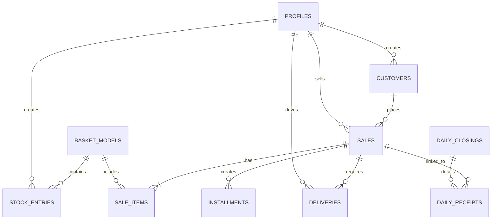

# Dicionário de Dados - Compra do Mês Logística

Este documento descreve a estrutura do banco de dados no Supabase para o sistema de logística e vendas da Cesta Básica na sua Casa.

## Diagrama ER (Resumido)

## Tabelas Principais

### 1. `profiles`
Estende os usuários do `auth.users` com informações específicas do sistema.

| Coluna | Tipo | Descrição |
| :--- | :--- | :--- |
| `id` | UUID | Chave primária (referência a `auth.users.id`). |
| `name` | TEXT | Nome completo do usuário. |
| `role`| TEXT | Papel: `gerente`, `vendedor`, `entregador` ou `cliente`. |
| `phone`| TEXT | Telefone para contato. |
| `status`| TEXT | `ativo` ou `inativo`. |
| `last_location` | JSONB | Últimas coordenadas GPS simuladas. |

### 2. `basket_models`
Catálogo de modelos de cestas disponíveis para venda.

| Coluna | Tipo | Descrição |
| :--- | :--- | :--- |
| `id` | UUID | Chave primária. |
| `name` | TEXT | Nome da cesta (ex: "Cesta Premium"). |
| `price` | DECIMAL | Valor de venda. |
| `weight` | TEXT | Peso aproximado. |
| `active` | BOOLEAN | Define se o modelo está visível para venda. |

### 3. `customers`
Cadastro de clientes.

| Coluna | Tipo | Descrição |
| :--- | :--- | :--- |
| `id` | UUID | Chave primária. |
| `name` | TEXT | Nome completo. |
| `cpf` | TEXT | CPF para emissão de nota fiscal (único). |
| `address` | TEXT | Logradouro. |
| `state` | TEXT | UF (Estado). |
| `created_by` | UUID | ID do vendedor que cadastrou o cliente. |

### 4. `sales`
Registro de vendas realizadas.

| Coluna | Tipo | Descrição |
| :--- | :--- | :--- |
| `id` | UUID | Chave primária. |
| `customer_id` | UUID | Referência ao cliente. |
| `seller_id` | UUID | Referência ao vendedor (se houver). |
| `total` | DECIMAL | Soma total dos itens. |
| `payment_method` | TEXT | `PIX`, `Cartão`, `A Prazo` ou `Na Entrega`. |
| `status` | TEXT | Status do pedido (Pendente, Entregue, etc). |

### 6. `corporate_customers`
Cadastro especializado para clientes empresariais (B2B).

| Coluna | Tipo | Descrição |
| :--- | :--- | :--- |
| `id` | UUID | Chave primária. |
| `company_name` | TEXT | Razão Social / Nome da Empresa. |
| `cnpj` | TEXT | CNPJ (único). |
| `responsible_name` | TEXT | Nome do contato principal. |
| `responsible_phone` | TEXT | Telefone do responsável. |
| `address` | TEXT | Endereço comercial completo. |

### 7. `supplies` (Insumos)
Banco de dados de produtos brutos (feijão, arroz, etc).

| Coluna | Tipo | Descrição |
| :--- | :--- | :--- |
| `id` | UUID | Chave primária. |
| `name` | TEXT | Nome do insumo. |
| `brand` | TEXT | Marca do produto. |
| `current_quantity` | NUMERIC | Estoque real em tempo real. |
| `min_stock` | NUMERIC | Nível crítico para alerta de compra. |
| `unit` | TEXT | Unidade de medida (kg, L, un). |

### 8. `supply_recipes` (Composições)
Define quais insumos compõem cada modelo de cesta.

| Coluna | Tipo | Descrição |
| :--- | :--- | :--- |
| `id` | UUID | Chave primária. |
| `name` | TEXT | Nome da composição. |
| `basket_model_id` | UUID | Vínculo com o modelo de venda. |
| `price` | NUMERIC | Custo base de produção. |

### 9. `supply_recipe_items`
Itens individuais de cada receita.

| Coluna | Tipo | Descrição |
| :--- | :--- | :--- |
| `recipe_id` | UUID | Referência à receita pai. |
| `supply_id` | UUID | Referência ao insumo. |
| `quantity` | NUMERIC | Quantidade necessária para 1 unidade. |

## Regras de Segurança (RLS)

- **Gerentes**: Acesso total a todas as tabelas para auditoria e gestão.
- **Vendedores**: Podem visualizar e gerenciar apenas seus próprios clientes, vendas e prestações de conta.
- **Entregadores**: Podem visualizar e atualizar apenas as entregas atribuídas a eles.
- **Clientes**: Acesso de leitura apenas aos seus próprios pedidos e perfil.
- **Produtos**: Visíveis para todos os usuários logados.
